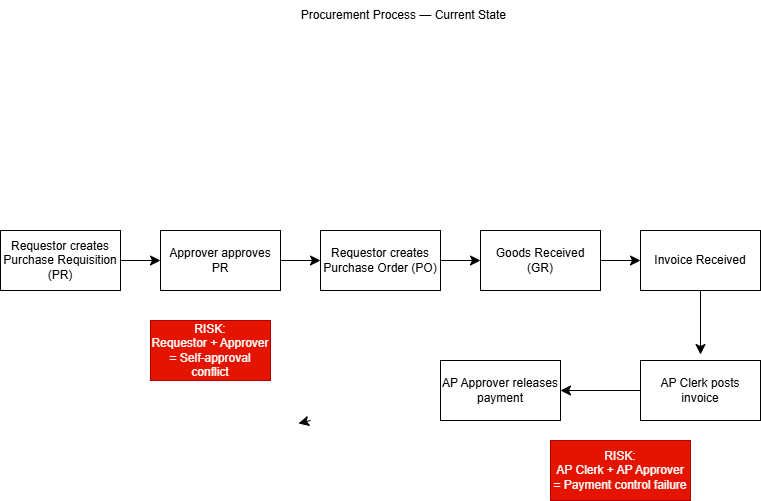
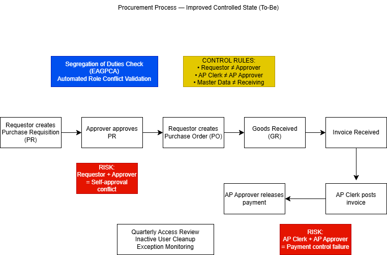

# Enterprise Access Governance \& Process Compliance Analyzer (EAGPCA)

## Overview

The Enterprise Access Governance \& Process Compliance Analyzer (EAGPCA) is a simulated SAP-style access control and segregation of duties (SoD) analysis tool.

This project models enterprise role assignments, detects access conflicts, performs risk scoring, and generates a structured compliance report in Excel format.

It is designed to reflect real-world Governance, Risk, and Compliance (GRC) practices used in enterprise systems.

---

## Business Problem

In large organizations, improper role combinations can create:

\- Fraud risk

\- Financial misstatement risk

\- Operational control breakdown

\- Safety compliance issues (critical in regulated industries)

For example:

\- A user should not both create and approve payments.

\- A procurement requestor should not approve their own requests.

\- Master data maintenance should not be combined with inventory receipt authority.

This project simulates these internal control checks.

---

## Features

\- Loads simulated SAP export data (users, roles, assignments)

\- Applies Segregation of Duties (SoD) rules

\- Flags HIGH and MEDIUM risk conflicts

\- Generates executive summary report

\- Exports structured Excel compliance report

\- Includes recommended remediation actions

---

## Tech Stack

\- Python 3

\- Pandas

\- OpenPyXL

\- CSV-based SAP-style export simulation

\- Git / GitHub

---

## Project Structure

EAGPCA/

│

├── data/ # Simulated SAP exports

├── src/ # Access analysis + reporting engine

├── reports/ # Generated compliance reports (ignored in Git)

├── docs/ # Process mapping diagrams (future)

└── README.md

---

## Example Risk Detection Output

\- HIGH: AP Clerk + AP Approver

\- HIGH: Procurement Requestor + Procurement Approver

\- MEDIUM: Vendor Master Maintainer + Inventory Receiver

---

## Governance Impact

This tool demonstrates:

\- Access governance fundamentals

\- Segregation of Duties enforcement

\- Internal control validation

\- Risk-based compliance reporting

\- Enterprise audit thinking

---

## Future Enhancements

\- Automated risk scoring algorithm

\- Role lifecycle analysis (inactive users, stale access)

\- Dashboard visualization

\- Process mapping integration (BPMN diagrams)

\- Automated remediation tracking

---

## Business Process Mapping

### Current State (As-Is)

This diagram illustrates the existing procurement workflow and highlights segregation-of-duties risks where a single user may both initiate and approve transactions.

---

### Improved Controlled State (To-Be)

This enhanced model introduces automated SoD validation and periodic access reviews to strengthen internal controls and reduce operational risk.

## Author

SK Sidratul Islam Priyo  

Computer Science Student  

University of Saskatchewan

